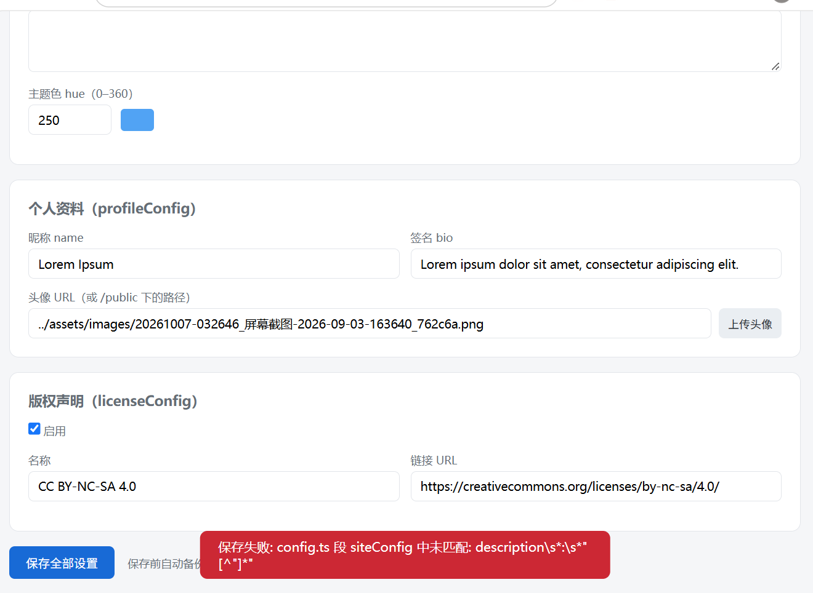

属性	描述
title	帖子标题。
published	帖子发布的日期。
description	简要介绍一下帖子。显示在索引页。
image	帖子封面图像路径。
1.以 或 开始：使用网页图片
2。以 开头：对于第
3条图片。不使用任何前缀：相对于标记文件http://https:///public
tags	帖子标签。
category	帖子的分类。
draft	如果这篇帖子还是草稿，那就不会显示出来。

